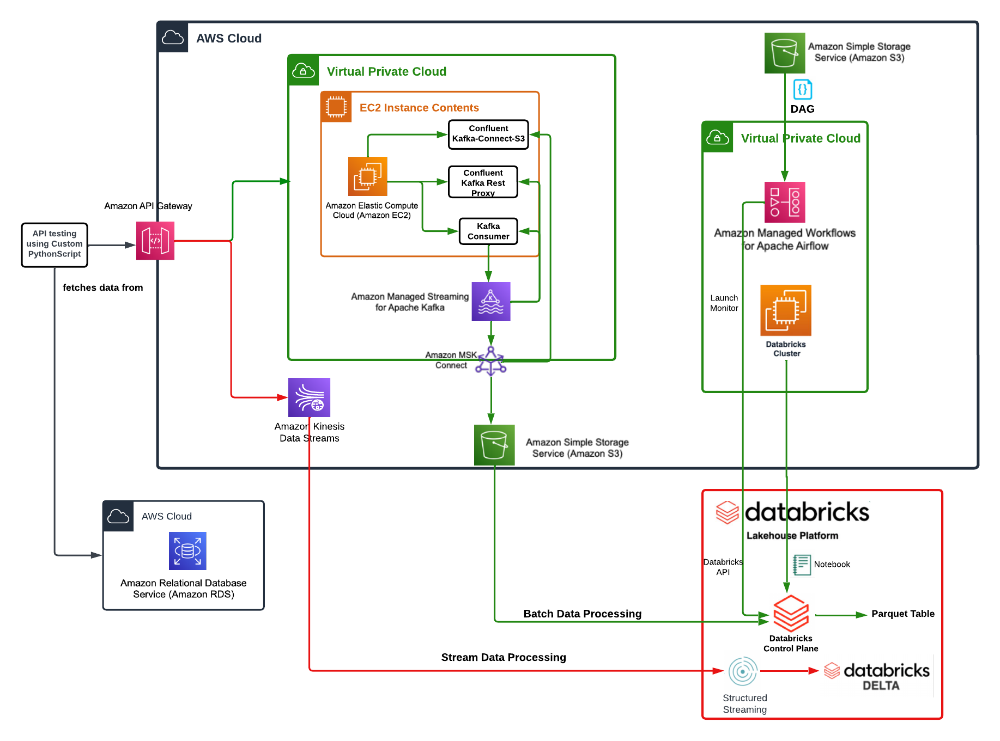

# Pinterest Data Pipeline

## Table of Contents
1. [Introduction](#introduction)
2. [Setting Up Environment](#setting-up-environment)
    1. [AWS Account](#aws-account)
    2. [Configure EC2 Instance](#configure-ec2-instance)
    3. [Setup Kafka on EC2 Instance](#setup-kafka-on-ec2-instance)
    4. [Create Kafka Topics](#create-kafka-topics)
3. [Connect the MSK cluster to a S3 bucket](#connect-the-msk-cluster-to-s3-bucket)
4. [Build a Rest API](#build-rest-api)
5. [Batch Data Processing in Databricks](#batch-data-processing-in-databricks)
6. [Batch Processing Using AWS MWAA](#batch-processing-using-aws-mwaa)
7. [Streaming Processing Using AWS Kinesis](#stream-processing-with-aws-kinesis)
8. [Usage Instructions](#usage-instructions)
9. [File Structure](#file-structure)
10. [License](#license)

## Architecture


## Introduction

Welcome to the Pinterest Data Pipeline project! This project is designed to extract, process, and analyze Pinterest data efficiently. The main aim of this project is to build a scalable and reliable data pipeline using modern data engineering tools and techniques.

Through this project, you will learned how to:
- Set up and configure AWS services
- Deploy and manage Kafka on EC2 instances
- Create and manage Kafka topics for efficient data streaming
- Store data in a datalake; we will be using Amazon S3.
- Transform and query the data using Databricks

## Setting Up Environment

### AWS Account

To begin, you will need an AWS account. If you don't have one, you can sign up for free at [AWS Free Tier](https://aws.amazon.com/free/). AWS provides various services that we will use to set up and run our data pipeline.
    - Create a .pem file locally on your machine which will store your key pair. Navigate to your parameter store in aws account to get your key-pair.

### Configure EC2 Instance

1. **Launch an EC2 Instance**: 
   - Log in to your AWS Management Console.
   - Navigate to the EC2 Dashboard.
   - Click on "Launch Instance".
   - Select an appropriate Amazon Machine Image (AMI).
   - Choose an instance type (e.g., t2.micro for testing purposes).
   - Configure instance details, add storage, and configure security groups.
   - Review and launch the instance.

2. **Access Your EC2 Instance**:
   - Use SSH to connect to your EC2 instance.
   - Ensure you have the necessary permissions set up for your security groups.
    - create a .pem key file locally in your project folder
    - Connect to your EC2 instance using ssh

### Setup Kafka on EC2 Instance
In order to setup Kafka on your ec2 client, you will need MSK cluster and Kafka installed.
Kafka required java to run so you will need to install Java first.
1. **Install Java**: Kafka requires Java to run.
   ```bash
   sudo apt update
   sudo apt install default-jdk -y
   ```

2. **Download Kafka**:
   ```bash
   wget https://downloads.apache.org/kafka/2.8.0/kafka_2.12-2.8.0.tgz
   tar -xzf kafka_2.12-2.8.0.tgz
   cd kafka_2.12-2.8.0
   cd kafka_2.12-2.8.0/libs
   ```
3. **Install AWS MSK**:
With Amazon MSK, you don't need to worry about managing your kafka operational overhead. MSK automatically provisions and runs your Apache Kafka clusters, as well as monitors the cluster's health.
    
    ```bash
    wget https://github.com/aws/aws-msk-iam-auth/releases/download/v1.1.5/aws-msk-iam-auth-1.1.5-all.jar
    check that the msk .jar file is in your libs folder

    Add the .jar file 
    ```


4. **Start Kafka Server**:
   - Start the ZooKeeper service:
     ```bash
     bin/zookeeper-server-start.sh config/zookeeper.properties
     ```
   - Start the Kafka broker service:
     ```bash
     bin/kafka-server-start.sh config/server.properties
     ```

### Create Kafka Topics

To create Kafka topics, you can use the following command:
```bash
bin/kafka-topics.sh --create --topic <topic_name> --bootstrap-server localhost:9092 --replication-factor 1 --partitions 1
```
Replace `<topic_name>` with the name of your topic.

### Connect the MSK cluster to a S3 bucket
You will need to use msk connect to connect the msk cluster to a s3 bucket such that any data going through the cluster will be automaticaaly saved and stored in a dedicated s3 bucket.
- First download the kafka connector .jar or zip file into your ec2 client from https://www.confluent.io/hub/confluentinc/kafka-connect-s3
- Upload the connector to your s3 bucket. use the command aws s3 cp kafka-connect-s3 s3://<bucket-name>/kafka-connect-s3/
 - Create a custom plugin with msk connect in the msk connector console. Select the s3 connector zip file as the plugin object.

    assume admin user privileges
    ```bash
    < sudo -u ec2-user -i >
    ```
    create directory where we will save our connector 
    
    ``` <mkdir kafka-connect-s3 && cd kafka-connect-s3> ```
    # download connector from Confluent
    ``` <sudo wget https://d1i4a15mxbxib1.cloudfront.net/api/plugins/confluentinc/kafka-connect-s3/versions/10.0.3/     confluentinc-kafka-connect-s3-10.0.3.zip> ```
    # copy connector to our S3 bucket
        '''
    <aws s3 cp ./confluentinc-kafka-connect-s3-10.0.3.zip s3://<BUCKET_NAME>/kafka-connect-s3/>
        '''
 - In your msk console, create a connetor and configure the connector properties as appropriate, select your access role and that's it.
 - Now, you're ready to start sending data to s3

## We will need to build our own API 
To replicate the pinterest data pipeline, we need to build our own API. This API will be the be able to send data to the msk cluster which will then be stored in the s3 bucket using the connector.
1. **Build Kafka REST PROXY integration method for the API**:
    - Create an API of your desired name
    - Create a resource on the the API so you can build a proxy integration on it.
    - On the resources, create a HTTP ANY method, create a resource and use your ec2 publicDNS as your endpoint url. Deploy the API make note of the invoke url.
2. **Setup Kafka REST PROXY on the EC2 client**
    -  Install the Confluent package for the Kafka REST Proxy on your EC2 client machine.
        To install the REST proxy package run the following commands on your EC2 instance:
        '''
            sudo wget https://packages.confluent.io/archive/7.2/confluent-7.2.0.tar.gz
            tar -xvzf confluent-7.2.0.tar.gz 
        '''
        cd into confluent-7.2.0/etc/kafka-rest and open kafka-properties to configure it.
        modify the bootstrap.servers and the zookeeper.connect variables in the file with your already generated values
        Add the aws-msk-iam configuration from this link to the file for authentication https://github.com/aws/aws-msk-iam-auth
    - Start and deploy the api if you've not done so before.
    - Start the REST PROXY 
    cd to confluent-7.2.0/bin in your ec2 client
    run the command ''' <./kafka-rest-start /home/ec2-user/confluent-7.2.0/etc/kafka-rest/kafka-rest.properties> '''
    If everything is setup correctly, you should see a info server running and listening for request.
3. **Send data to the API**:
Now, we are ready to send data to the API which will then send the data to the MSK Cluster using the plugin-connector pair previously created.
- Modify the python script  and add a post_data_to_api function. 
- Check the data is been consumed in your s3 bucket. You should see a topics folder with your topics name and the corresponding data respectively.

## Batch Data processing in Databricks
### Setup Databricks account
In order for us to clean and query the batch data, we need to read the data from the s3 bucket into databricks.
- Mout your s3 bucket to the databricks account
- Read in the data from the Delta table, located at '''< dbfs:/user/hive/warehouse/authentication_credentials >'''
- Read in the json files from the s3 bucket and convert to dataframe. Create 3 dataframes for the 3 topics in the s3 bucket.
If all works well. start clening the data.
All done at this stage.
- Clean the data, perform some computations using pyspark or spark SQL. I prefer pyspark.

## Looking Ahead...Orchestrate Databricks Workflow on AWS MWAA (Managed Workflow for Apache Airflow)
## Batch Processing Using AWS MWAA
To use Job API with aws mwaa to monitor DAG with Databricks based tasks. Create a DAG that connects to a Databricks cluster, then use AWS MWAA to monitor the execution.
1. **Create an API token in Databricks**:
- Have access to a Databricks workspoace. 
- Create a cluster to use in the workspace.
- Create an access token. You might set the expiry date to lifetime. Note the acess toke.
2. **Create the MWAA to Databricks connection**:
- Open the Airflow UI from the MWAA environment. 
- Navigate to admin and select connections, select databricks_default, paste your access token, fill the host with your databricks account url. Fill extra column with ```{"token": "<token_from_previous_step>", "host": "<url_from_host_column>"}```. Your connecttion type should be databricks.
- If the connection type is missing, you will need to install some other packages using requirements.txt
3. **Create & upload requirements.txt file**:
- Clone the local runner github repo; ```git clone https://github.com/aws/aws-mwaa-local-runner.git```
- cd to ```cd aws-mwaa-local-runner```
- Build a docker image with ```./mwaa-local-env build-image```
- Run the local airflow environment with ```./mwaa-local-env start```
- Open the Apache Airflow UI at http://localhost:8080/
- Navigate to ```aws-mwaa-local-runner/requirements/``` locally and create requirements.txt file.
- Add this line to requirements.txt file ```apache-airflow[databricks]``` to install databricks connection type.
- Test that everything is running with ```./mwaa-local-env test-requirements```
- Upload the requirements.txt file to the S3 bucket
4. **Specify the file path in Requirements file field**:
- On AWS MWAA console environment, click edit, under the DAG code in Amazon S3, update your Requirements file field by selecting the path corresponding to the requirements.txt file you have just uploaded to the S3 bucket
- In the Airflow UI, go back to connections and select databricks_default. The connection type should have Databricks option.
- Create DAG and upload to the DAGS folder. It should appear in the Airflow UI.

## Stream Processing with AWS Kinesis
Now, send streaming data to Kinesis and read this data in Databricks
- Using Kinesis Data Streams in your AWS console create data streams, one for each data table.
Navigate to the Kinesis console, and select the Data Streams section. Choose the Create stream button
- Configure API with Kinesis proxy integration
Create an IAM role in the IAM console that assumes the AmazonKinesisFullAccessRole policy.
List stream source, Create, describe and delete streams in Kinesis, Set up the POST, DELETE methods, Add records to streams in Kinesis, Set up the records PUT method, deploy and invoke your API.
- Send Data to the kinesis Streams
Create a new script, user_posting_emulation_streaming.py, that builds upon the initial user_posting_emulation.py. Send requests to the API from this script which will add one record at a time to the stream.
- Read the data from kinesis streams in databricks
Create a new notebook that read-in the data in databricks. You will need your access key and secret key here.
- Transform and clean the data as appropriate.
- Write the streaming data to delta tables.

## Usage Instructions

1. **Setup AWS Environment**: Follow the steps in the [Setting Up Environment](#setting-up-environment) section to configure your AWS account, EC2 instances, and Kafka setup.

2. **Run the Data Pipeline**:
    - Ensure that your Kafka broker and ZooKeeper service are running.
    - Start the REST API to send data to Kafka. Use the provided Python script to post data to the API.
    - Check your S3 bucket to ensure data is being saved correctly.

3. **Process Data with Databricks**:
    - Mount your S3 bucket in Databricks.
    - Load the data from S3 into Databricks Delta tables.
    - Clean and process the data using PySpark or Spark SQL.

4. **Schedule Batch Processing with MWAA**:
    - Set up MWAA and create a DAG for Databricks workflows.
    - Use the MWAA environment to monitor and manage your data pipeline.

5. **Stream Data with Kinesis**:
    - Set up Kinesis Data Streams and integrate with your API.
    - Send streaming data to Kinesis and read the data in Databricks for real-time processing.

### Running the Pipeline

```bash
# Connect to your EC2 instance
ssh -i your-key-pair.pem ec2-user@your-ec2-instance-public-dns

# Start ZooKeeper
cd kafka_2.12-2.8.0
bin/zookeeper-server-start.sh config/zookeeper.properties

# Start Kafka broker
bin/kafka-server-start.sh config/server.properties

# Run the API
python your_api_script.py

# Post data to the API (from another terminal or script)
python post_data_to_api.py
```

## File Structure
```plaintext
Pinterest-Data-Pipeline/
├── api/
│   ├── __init__.py
│   ├── api.py
│   ├── requirements.txt
│   └── Dockerfile
├── connectors/
│   └── kafka-connect-s3/
│       └── confluentinc-kafka-connect-s3-10.0.3.zip
├── dags/
│   ├── __init__.py
│   ├── databricks_dag.py
│   └── requirements.txt
├── scripts/
│   ├── fetch_data_from_db.py
│   ├── post_data_to_api.py
│   └── user_posting_emulation_streaming.py
├── notebooks/
│   ├── data_processing_notebook.ipynb
│   └── streaming_data_processing_notebook.ipynb
├── resources/
│   └── CloudPinterestDataPipeline.png
├── .gitignore
├── README.md
└── LICENSE```

## License

This project is licensed under the MIT License. See the [LICENSE](LICENSE) file for more information.

---

Feel free to contribute to this project or raise issues if you encounter any problems. Happy coding!